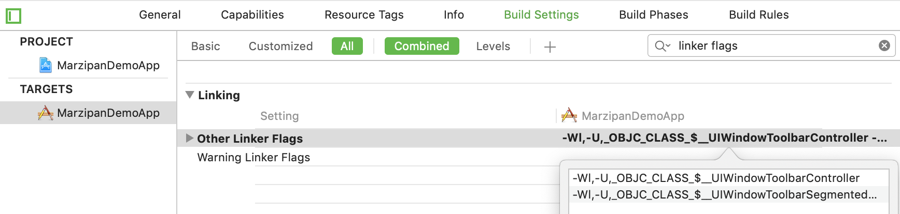

# Marzipan Demo App

This is the demo app used in the talk “Hacking Marzipan” by Tom Lokhorst at [Do iOS 2018](https://do-ios.com).

> ⚠️ _This project is for demonstration purposes only, it is not meant to be used in production apps. Use at your own risk!_

Build and tested on macOS 14.0 and 14.1 with Xcode 10.

## Overview

This document explains how to create your own iOSMac (Marzipan) apps, using Steve Throughton Smith's [marzipanify](https://github.com/steventroughtonsmith/marzipanify) tool.

The demo application uses Swift, a storyboard, and calls private API's to display a segmented control in the window toolbar.


## Disable macOS Security (Don't do this on your main device!)

To run a converted (marzipanified) app, you need to disable System Integrety Protection and AMFI:

1. Restart you Mac in recovery mode by holding ⌘+R while booting
2. In the Terminal, run `csrutil disable`
3. In the Terminal, run `nvram boot-args="amfi_get_out_of_my_way=0x1"`
4. Restart you Mac
5. Your system is now vulnarable to malware and you can run marzipanified apps

Details: [How to Disable System Integrity Protection on a Mac (and Why You Shouldn’t)](https://www.howtogeek.com/230424/how-to-disable-system-integrity-protection-on-a-mac-and-why-you-shouldnt/)

To re-able these security settings, reboot again in recovery mode and run: `csrutil enable` and `nvram boot-args="amfi_get_out_of_my_way=0x0"`


## Marzipanify an iOS UIKit app

Use marzipanify to convert a iOS simulator binary to a macOS app:

> _marzipanify is an unsupported commandline tool to take an existing iOS Simulator binary (with minimum deployment target of iOS 12.0) and statically convert it and its embedded libraries & frameworks to run on macOS 10.14's UIKit runtime (Marzipan)._

1. Clone [marzipanify](https://github.com/steventroughtonsmith/marzipanify) and build the command line tool
2. Create a new iOS app (with minimum deployment target of iOS 12)
3. Build your app for the iOS Simulator
4. Run `marzipanify YourApp.app`  
   (make sure not to accidentaly add a slash at the end: `marzipanify YourApp.app/` won't work)
5. If your app uses Swift, whitelist by editing `/System/iOSSupport/dyld/macOS-whitelist.txt` and adding `/path/to/YourApp.app/Contents/MacOS/`
6. Run the converted app with lldb to see output: `lldb YourApp.app -o run`
7. The converted app must be deleted (or moved) to be able to build again in Xcode

**Note:**
If your app uses Cocoapods, add this to your Podfile to make sure all pods also have a iOS 12 deployment target:

```ruby
post_install do |installer|

   installer.pods_project.targets.each do |target|
     target.build_configurations.each do |config|
       config.build_settings['IPHONEOS_DEPLOYMENT_TARGET'] = '12.0'
     end
   end

end
```

## Marzipanify script

For a quick build-run-test cycle, this script cleans up the marzipanified app:

```bash
#!/bin/sh

appname=$1

if [[ $appname == *".app"* ]]; then
  echo "Argument shoudn't include .app"
  exit
fi

rm -rf $appname-mz.app
marzipanify $appname.app
mv $appname.app $appname-mz.app
lldb $appname-mz.app -o run
```

## Segmented control in Window toolbar

To create a nice macOS-style segmented control in the window toolbar, we need to use some private APIs and Objective-C code.

1. Use [class-dump](http://stevenygard.com/projects/class-dump/) to look at all the private APIs in UIKit for the Mac  
   Run: `class-dump /System/iOSSupport/System/Library/PrivateFrameworks/UIKitCore.framework > UIKitCore.h`
2. Add new Objective-C .h and .m files to your project and include the header in your Swift code via a Briding header
3. In the header file, include the private APIs from UIKitCore you which to use (see [MarzipanHelper.h](MarzipanDemoApp/MarzipanHelper.h))
4. In the implementation file, use those APIs (see [MarzipanHelper.m](MarzipanDemoApp/MarzipanHelper.m))
5. Add the private classes used to the linker flags, to weak link them: . 
   Example: `-Wl,-U,_OBJC_CLASS_$__UIWindowToolbarController`

For more details, read Peter Steinberger's post on [becoming a better Mac citizen](https://pspdfkit.com/blog/2018/porting-ios-apps-to-mac-marzipan-iosmac-uikit-appkit/#become-a-better-mac-citizen), or see the example code in this repository.

## Acknowledgements

This talk and repository have been made possible by the work of many people, a partial list:

- Tweets from [Steve Troughton Smith](https://twitter.com/stroughtonsmith)
- Peter Steinberger's post on [Marzipan](https://pspdfkit.com/blog/2018/porting-ios-apps-to-mac-marzipan-iosmac-uikit-appkit/)
- Vlas Voloshin's talk at CocoaHeads Melborn on [Marzipan Internals](https://www.youtube.com/watch?v=EpUnke2yDug)
- My collegues at [Q42](https://q42.com) for their help in preparing the talk and researching weird linker issues

---

_Tom Lokhorst - [@tomlokhorst](https://twitter.com/tomlokhorst)  
1 November 2018_
